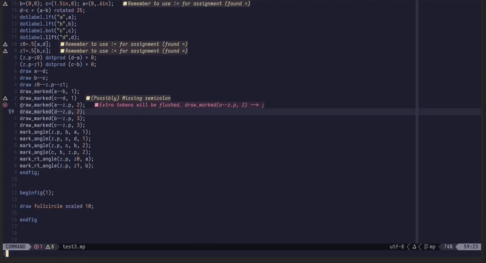

# mplint.nvim — MetaPost linter & formatter for Neovim

MetaPost plugin for Neovim with two tools:

- **Linter**: compiler errors, style checks, structure checks  
- **Formatter**: whitespace cleanup, indentation inside blocks, blank-line spacing

---

## Linter

The linter runs in three passes:

1. **Compiler errors** (parse `.log`)  
2. **Style checks** (semicolon rules, TeX preamble lines)  
3. **Structure checks** (begin/end blocks, delimiters, `verbatimtex`/`btex`, simple assignment `=` vs `:=` heuristic)

Diagnostics are emitted as gfortran-style lines:

file:line:col: Severity: message



---


---

## Formatter

The formatter is lightweight and opinionated:

- Removes trailing spaces  
- Indents only *inside* code blocks:
  - `def/vardef/primarydef/secondarydef/tertiarydef … enddef`  
  - `if … fi`  
  - `for/forsuffixes … endfor`  
  - `verbatimtex … etex`  
  - `beginfig … endfig`  
  - `begingroup … endgroup`  
- Adds a blank line before and after each block  
- Supports **single-line blocks** (`begingroup … endgroup` on one line):  
  → no extra indent, but still spaced with blank lines


**Commands / Keymaps:**
- `:MplintIndent` → re-format the current buffer  
- `<leader>fm` → buffer-local keymap (default), configurable or disabled  

---

## What is MetaPost?

[MetaPost](https://www.tug.org/metapost.html) is a programming language for creating vector graphics, designed by Donald Knuth and derived from METAFONT’s ideas but producing PostScript/Encapsulated PostScript output. It’s particularly good at precise, mathematically-defined drawings (diagrams, plots, geometric constructions).

- Official user manual (PDF): [MetaPost: A User’s Manual](https://www.tug.org/docs/metapost/mpman.pdf)

### Why linting & formatting MetaPost is tricky

MetaPost (and its TeX heritage) has idiosyncrasies that complicate static tooling:

- **Error context lives in the `.log`**  
- **Semicolons are context-sensitive**  
- **TeX preamble blending**  
- **Opaque regions** (`verbatimtex`, `btex`)  
- **Balanced construct pairs** (`beginfig/endfig`, `begingroup/endgroup`, etc.)  
- **Blocks can be single-line or multi-line**  

Because of this, `mplint.nvim` parses the `.log` for real compiler errors, augments with source heuristics, and formats code conservatively.

---

## Errors vs Warnings

- **Errors**: findings from the `.log` (pass 1) — actual `mpost` errors.  
- **Warnings**: findings from the `.mp` source (passes 2 & 3) — heuristics that flag suspicious lines but aren’t compiler failures.  

---

## Requirements

- Neovim (tested on 0.11.3)  
- `mpost` in your `$PATH` (bundled with TeX Live / MiKTeX / MacTeX)  
- [nvim-lint](https://github.com/mfussenegger/nvim-lint)  

---

## Install (lazy.nvim)

```lua
return {
  {
    "jduspmc/mplint.nvim",
    dependencies = { "mfussenegger/nvim-lint" },
    event = { "BufReadPost", "BufNewFile" },
    opts = {
      -- Linter
      halt_on_error = false,        -- stop at first error if true
      line_diag_key = "<leader>gl", -- set false to disable mapping
      filetypes = { "mp", "metapost" },

      -- Formatter
      indent_width = 4,             -- spaces to indent inside blocks
      indent_blank_lines = true,    -- add blank line before/after blocks
      indent_key = "<leader>fm",    -- buffer-local keymap (false to disable)
    },
  },
}
```
## Options & Commands

### Linter Options

MetaPost often **cascades** errors: a single mistake (e.g., a missing `;` or an unclosed `enddef`) can derail parsing and produce **many** `! …` messages in the `.log`. In those cases, it’s usually more productive to fix the **first** real error and re-run.

- **`halt_on_error`**  
  - `true`: run `mpost` with `--halt-on-error`, stop at the first error.  
  - `false` (default): run with `--interaction=nonstopmode`, show all errors.  

- **`:MplintToggleHalt`**  
  Toggle between halt-on-error and nonstop mode, then re-lint immediately.  

- **`line_diag_key`**  
  Buffer-local keymap to show diagnostics for the current line.  
  Default: `<leader>gl` (set to `false` to disable).  

- **`filetypes`**  
  Filetypes that trigger linting.  
  Default: `{ "mp", "metapost" }`.  

---

### Formatter Options

- **`indent_width`**  
  How many spaces to indent inside blocks.  
  Default: `4`.  

- **`indent_blank_lines`**  
  Whether to insert a blank line before and after blocks.  
  Default: `true`.  

- **`indent_key`**  
  Buffer-local keymap to run the formatter.  
  Default: `<leader>fm` (set to `false` to disable).  

- **`:MplintIndent`**  
  Manually format the current buffer.  


# Motivation

I enjoy MetaPost and find it a more direct way to describe geometric drawings than large macro packages like TikZ. My goal with mplint.nvim is to provide a lightweight, helpful linter that makes it easier to learn and iterate with MetaPost, surfacing genuine mpost errors alongside gentle hints for common style/structure issues.

License: MIT
