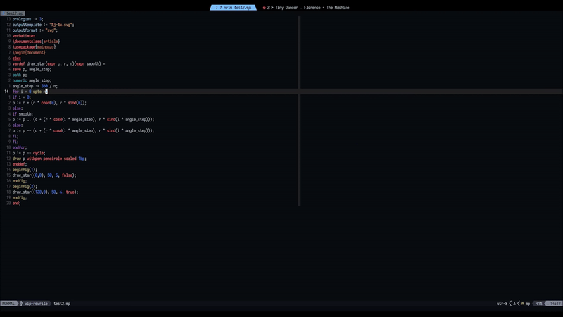
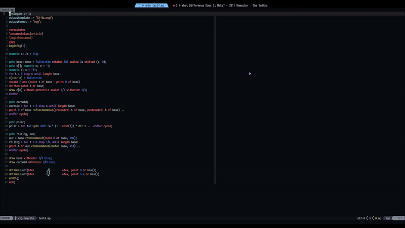
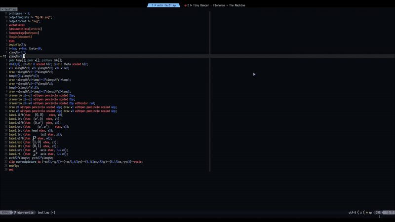

<!-- markdownlint-disable MD013 -->
# MetaPost linter, formatter & previewer

`mplint.nvim` provides three complementary tools for working with MetaPost in Neovim:

- **Linter**: compiler errors, style checks, structure checks
- **Formatter**: whitespace cleanup, indentation, blank-line spacing
- **Previewer**: live rendering of compiled MetaPost figures inside a floating buffer using the [image.nvim](https://github.com/3rd/image.nvim) API

---

## Demo

| Formatter | Previewer | Linter |
|:---------:|:---------:|:------:|
|  |  |  |

## Linter: Errors vs. warnings

The linter operates in two passes:

1. **Compilation errors:** Parses the `.log` file and reports `mpost` compiler errors in GNU-style format (`file:line:column: severity: message`).
2. **Structural checks:** Parses the `.mp` source to detect unmatched `begin`/`end` blocks and other balanced constructs, accidental use of `=` instead of `:=`, missing or misplaced semicolons, TeX preamble issues, and other common mistakes.

### Why linting and formatting MetaPost is difficult

MetaPost—and its TeX heritage—has some characteristics that make static analysis challenging:

- **Compiler diagnostics are emitted to the `.log` file**
- **Semicolon rules are context-sensitive**
- **MetaPost and TeX syntax are interleaved**
- **Opaque regions** (`verbatimtex`, `btex`) cannot be parsed as ordinary MetaPost code
- **Balanced constructs can be nested and interleaved** (`for`, `if`, `vardef`, ...)
- **Blocks may span multiple lines or fit on a single line**

For these reasons, `mplint.nvim` combines compiler diagnostics from the `.log` file with source-level analysis.

---

## Formatter behavior

The formatter is lightweight and opinionated:

- Removes trailing spaces
- Indents only *inside* code blocks:
  - `def/vardef/primarydef/secondarydef/tertiarydef … enddef`
  - `if … fi`
  - `for/forsuffixes … endfor`
  - `verbatimtex … etex`
  - `beginfig … endfig`
  - `begingroup … endgroup`
- Adds a blank line before and after each block
- Supports **single-line blocks** `begingroup … endgroup` on one line

---

## What is MetaPost?

[MetaPost](https://www.tug.org/metapost.html) is a programming language for creating vector graphics, developed by John Hobby and based on Donald Knuth's **METAFONT**. It uses a mathematical description of graphics to produce high-quality PostScript, PDF, and SVG illustrations, making it ideal for diagrams, plots, and geometric constructions.

- Official user manual: [MetaPost: A User’s Manual](https://www.tug.org/docs/metapost/mpman.pdf)
- Awesome resources: [Drawing with MetaPost](https://github.com/thruston/Drawing-with-Metapost) and [Metafun](https://www.pragma-ade.nl/general/manuals/metafun-p.pdf). Some tests come from Toby Thurston's examples.

---

## Requirements

- Neovim (tested with 0.12.3)
- `mpost` available in your `$PATH` (included with TeX Live, MiKTeX, and MacTeX)
- For the previewer: these are optional if linting is the only concern.
  - [image.nvim](https://github.com/3rd/image.nvim) and its dependencies for the previewer.
  - ImageMagick (used to convert EPS and numbered MetaPost output to PNG when necessary)
- Optional: [conform.nvim](https://github.com/stevearc/conform.nvim) and [nvim-lint](https://github.com/mfussenegger/nvim-lint). `mplint.nvim` can register with these plugins but also works independently through its own user commands. See below for details.

 The plugin was tested with the [kitty](https://sw.kovidgoyal.net/kitty/) rendering backend.

---

## Install

### lazy.nvim

```lua
return {
  {
    "jduspmc/mplint.nvim",
    opts = {
      -- linter
         linter_backend = 'manual', -- Options: 'nvim-lint' or 'manual'
         halt_on_error = false, -- Stop at first error if true
         filetypes = { 'mp' }, --  To which filetypes to attach,
         events = { 'BufWritePost', 'InsertLeave' }, -- When to run linter
         enabled = true, -- Enable linter
         tex_engine = nil, -- Auto-detect TeX engine ("latex", "tex", etc.)
         -- Formatter
         indent_width = 4, -- Spaces to indent inside blocks
         blank_lines = false, -- Add blank line before/after blocks
         -- Previewer
         preview_enabled = false, -- Enable live rendering previewer
         preview_scale = 1, -- Image scaling factor
     },
  },
}
```

### vim.pack

```lua
vim.pack.add {
  'https://github.com/jduspmc/mplint.nvim',
}
require('mplint').setup {
   -- linter
   linter_backend = 'manual', -- Options: 'nvim-lint' or 'manual'
   halt_on_error = false, -- stop at first error if true
   filetypes = { 'mp' }, -- which filetypes to attach,
   events = { 'BufWritePost', 'InsertLeave' }, -- when to run linter
   enabled = true, -- enable linter
   tex_engine = nil, -- auto-detect TeX engine ("latex", "tex", etc.)
   -- Formatter
   indent_width = 4, -- spaces to indent inside blocks
   blank_lines = false, -- add blank line before/after blocks
   -- Previewer
   preview_enabled = false, -- enable rendering previewer
   preview_scale = 1, -- Image scaling factor
}
```

## Configuration & Commands

### Linter

| Option | Default | Description |
| --- | :---: | --- |
| `enabled` | `true` | Enable or disable the linter. |
| `linter_backend` | `"manual"` | Linting backend. Use `"manual"` for the built-in linter command or `"nvim-lint"` to integrate with `nvim-lint`. |
| `halt_on_error` | `false` | If true, stop after the first compiler error instead of collecting all errors. Uses the `mpost` flags `-halt-on-error` and `-interaction=nonstop`. |
| `events` | `{ "BufWritePost", "InsertLeave" }` | Neovim autocommand events that trigger automatic linting. |
| `filetypes` | `{ "mp" }` | Filetypes for which the plugin is active. |
| `tex_engine` | `nil` | TeX processor passed to `mpost` via `-tex=<engine>` (e.g. "latex", "tex"). When nil, mplint.nvim automatically detects whether the source requires LaTeX. |

MetaPost errors often cascade: one syntax error can generate dozens of misleading diagnostics. `mplint.nvim` lets you switch between halt-on-error (first error only) and nonstop (all compiler errors) modes, depending on whether you prefer focused debugging or a complete error list.

| Command | Description |
| --- | --- |
| `:MplintToggleLint` | Toggle automatic linting on or off. Disabling it immediately clears all diagnostics. |
| `:MplintToggleHalt` | Toggle between halt-on-error and nonstop mode, then re-run the linter. |

### Formatter

| Option | Default | Description |
| --- | :---: | --- |
| `indent_width` | `4` | Number of spaces used for indentation. |
| `blank_lines` | `false` | If true, insert blank lines around block constructs. |

| Command | Description |
| --- | --- |
| `:MplintIndent` | Format the current buffer. |

### Previewer

The previewer compiles the current MetaPost file in a temporary directory and displays the rendered output in a centered floating window using `image.nvim`.

| Option | Default | Description |
| --- | :---: | --- |
| `preview_enabled` | `false` | If true, register the `:MplintPreview` command. |
| `preview_scale` | `1` | Default image scaling factor for the preview window. Override with `:MplintPreview [scale]`. |

| Command | Description |
| --- | --- |
| `:MplintPreview [scale]` | Compile and preview the current file. Optional positive integer `scale` controls preview size. If MetaPost produces EPS, ImageMagick converts it to PNG. Press `q` to close the preview. |

---

## Integration with `conform.nvim` and `nvim-lint`

`mplint.nvim` automatically registers its formatter and linter under the name `"mplint"` during `setup()`. To use them with `conform.nvim` or `nvim-lint`, simply reference `"mplint"` in their respective configurations.

### `conform.nvim`

```lua
require("conform").setup({
  formatters_by_ft = {
    mp = { "mplint" },
  },
})
```

### `nvim-lint`

If `nvim-lint` is responsible for deciding when linting runs (for example, through its own autocommands), disable `mplint.nvim`'s automatic linting events to avoid duplicate lint runs:

```lua
require("mplint").setup({
  events = {},
})
```

Then register the linter with `nvim-lint`:

```lua
require("lint").linters_by_ft = {
  mp = { "mplint" },
}
```

---

## Motivation

I enjoy using MetaPost and find it a more direct way to describe geometric drawings than large macro packages like TikZ. mplint.nvim attempts to make the MetaPost workflow a little smoother by providing tools that simplify learning, experimentation, and iteration.

License: [MIT](https://github.com/jduspmc/mplint.nvim/blob/main/LICENSE)
